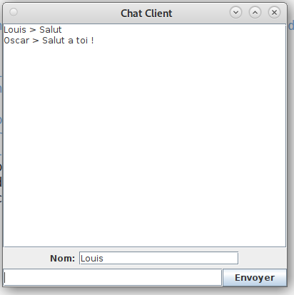

## Messageries

### Contexte du projet

Le projet constiste a crée une messagerie entre plusieurs utilisateurs, codé en java avec un server et un client accompagné d'une interface ihm pour faciliter l'échange entre les utilisateurs.
L'idée de la messagerie vien des cours réaliser en introduction réseaux (R2.05).

### Utilisation de l'application

Une fois le server ouvert, prêt a recevoir des clients, on peut sur n'importes quellles machines se connecter au serveur puis communiquer avec tous les autres clients connectés.

Pour identifier les clients, l'affichage propose au dessus de la ou l'on envoie des messages la possibilité de choisir son pseudonyme et on peut le changer sans se déconnecter puis se reconnecter.

Affichage ci dessous:

L'application affiche tous les messages pour que tout le monde puisse communiquer, si l'affichage de la discussion commence a être long alors une scroll bar apparaît pour pouvoir consulter les anciens messages.
Tout disparaît lorsque la personne qui a ouvert le serveur décide de le fermer, dans ce cas la rien n'est enregistrer.

### Les fichiers de projets

Le projet possède 2 programe java, un server qui prend en parametre le nom de l'ordinateur et un port, et un client qui va etre possitionner dans un Thread pour pouvoir avoir plusieurs clients et qui va contenir tous l'interfaces ihm.

### Le Docker

Nous avons utilisés un dockerfile pour pouvoir lançer le serveur, mais le client lui doit etre éxécuté sur un autre terminal 
